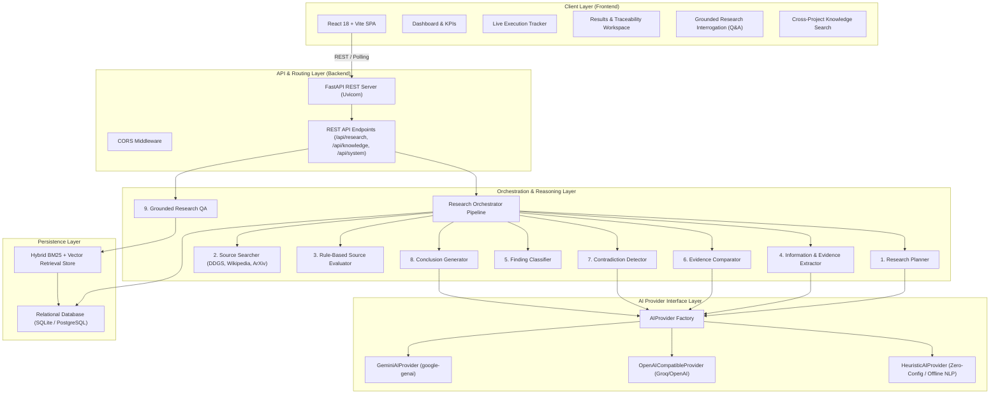

# Architecture Diagram Specification — Enterprise AI Research Agent

**Author**: Jay Beedkar  
**Contact**: [jayudict@gmail.com](mailto:jayudict@gmail.com)  
**Repository**: [github.com/jay2244-byte/Enterprise-ResearchAI-Agent](https://github.com/jay2244-byte/Enterprise-ResearchAI-Agent)

---

## 1. System Architecture Overview

The **Enterprise AI Research Agent** follows a decoupled, 3-tier architecture comprising a React 18 single-page application, a FastAPI REST API gateway, an asynchronous 11-stage research orchestrator, a modular reasoning & web retrieval layer, and a persistent relational database.



---

## 2. 11-Stage Pipeline Data Flow Diagram

```mermaid
sequenceDiagram
    autonumber
    actor User
    participant UI as React Dashboard
    participant API as FastAPI Server
    participant Orch as Research Orchestrator
    participant Web as Web & Academic APIs
    participant AI as AI Provider Layer
    participant DB as Relational Database

    User->>UI: Submit Research Question
    UI->>API: POST /api/research
    API->>DB: Persist Project (status="queued")
    API->>Orch: Trigger Async Background Run
    API-->>UI: Return Project Metadata

    rect rgb(25, 35, 55)
        note over Orch: 11-Stage Execution Pipeline
        Orch->>AI: 1. Plan Research Sub-Questions
        AI-->>Orch: Sub-Questions (Technology, Cost, Risk, etc.)
        Orch->>DB: Store Sub-Questions
        
        Orch->>Web: 2 & 3. Search DuckDuckGo, Wikipedia, ArXiv
        Web-->>Orch: Scraped Clean Page Text & Snippets
        
        Orch->>Orch: 4 & 5. Rule-Based Source Reliability Scoring (0-100)
        Orch->>DB: Store Sources & Reliability Breakdowns
        
        Orch->>AI: 6 & 7. Extract Findings & Verbatim Quotes
        AI-->>Orch: Findings + Quotes
        Orch->>DB: Store Findings & Evidence Records
        
        Orch->>AI: 8. Compare Evidence Across Topics
        AI-->>Orch: Topic Syntheses & Perspective Alignment
        Orch->>DB: Store Evidence Comparisons
        
        Orch->>AI: 9. Detect Contradictions & Contextual Tensions
        AI-->>Orch: Conflict Explanations & Context Types
        Orch->>DB: Store Contradictions
        
        Orch->>AI: 10 & 11. Synthesize Executive Conclusions & Traceability
        AI-->>Orch: Conclusions with Supporting Finding Indices
        Orch->>DB: Link Conclusions -> Findings -> Evidence -> Sources (Status="completed")
    end

    UI->>API: GET /api/research/{id}/progress (Polling)
    API-->>UI: Live Stage & Logs
    UI->>API: GET /api/research/{id}/conclusions
    API-->>UI: Complete Results + Traceability Lineage
```



---

## 3. Evidence Traceability Lineage Flow

```text
                                [ EXECUTIVE CONCLUSION ]
                                "Predictive Automation Drives
                                Immediate Operational Velocity"
                                           │
                                           ▼ (Many-to-Many Association)
                                 [ SUPPORTING FINDING ]
                                 "Better Software & Architecture
                                 Underpins Empirical Research"
                                           │
                                           ▼ (One-to-Many Relation)
                                 [ VERBATIM EVIDENCE QUOTE ]
                                 "April 1, 2025 - Better software
                                 drives better research..."
                                           │
                                           ▼ (Foreign Key Relation)
                                  [ ORIGINAL SOURCE RECORD ]
                                  Title: IEEE Computer Society
                                  URL: https://www.computer.org/...
                                  Reliability Score: 48.0 / 100 (Medium)
```
