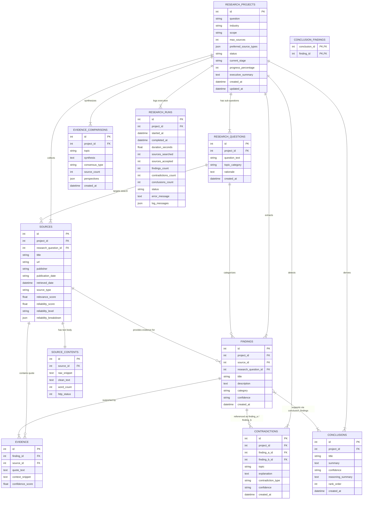

# Database Data Model & ER Diagram Specification

**Author**: Jay Beedkar  
**Contact**: [jayudict@gmail.com](mailto:jayudict@gmail.com)  
**Repository**: [github.com/jay2244-byte/Enterprise-ResearchAI-Agent](https://github.com/jay2244-byte/Enterprise-ResearchAI-Agent)

---

## 1. Entity-Relationship (ER) Diagram

---

## 2. Relational Table Specifications

### 1. `research_projects`
Main entity representing a research project commissioned by a user.
- **Primary Key**: `id` (Integer)
- **Fields**: `question` (String, Indexed), `industry` (String), `scope` (String), `max_sources` (Integer), `preferred_source_types` (JSON), `status` (String, Indexed), `current_stage` (String), `progress_percentage` (Integer), `executive_summary` (Text), `created_at` (DateTime), `updated_at` (DateTime).

### 2. `research_questions`
Targeted sub-questions deconstructed during Stage 1 (Research Planning).
- **Primary Key**: `id` (Integer)
- **Foreign Key**: `project_id` → `research_projects.id` (`ON DELETE CASCADE`)
- **Fields**: `question_text` (String), `topic_category` (String), `rationale` (Text), `created_at` (DateTime).

### 3. `sources`
Metadata and reliability evaluations for verified public web/academic pages.
- **Primary Key**: `id` (Integer)
- **Foreign Keys**: `project_id` → `research_projects.id` (`ON DELETE CASCADE`), `research_question_id` → `research_questions.id` (`ON DELETE SET NULL`)
- **Fields**: `title` (String), `url` (String, Indexed), `publisher` (String), `publication_date` (String), `retrieved_date` (DateTime), `source_type` (String), `relevance_score` (Float), `reliability_score` (Float), `reliability_level` (String), `reliability_breakdown` (JSON).

### 4. `source_contents`
Clean scraped text and word counts.
- **Primary Key**: `id` (Integer)
- **Foreign Key**: `source_id` → `sources.id` (`ON DELETE CASCADE`, Unique)
- **Fields**: `raw_snippet` (Text), `clean_text` (Text), `word_count` (Integer), `http_status` (Integer).

### 5. `findings`
Structured empirical findings extracted during Stage 6.
- **Primary Key**: `id` (Integer)
- **Foreign Keys**: `project_id` → `research_projects.id` (`ON DELETE CASCADE`), `source_id` → `sources.id` (`ON DELETE SET NULL`), `research_question_id` → `research_questions.id` (`ON DELETE SET NULL`)
- **Fields**: `title` (String), `description` (Text), `category` (String, Indexed), `confidence` (String), `created_at` (DateTime).

### 6. `evidence`
Verbatim quote passages extracted from source text supporting a finding.
- **Primary Key**: `id` (Integer)
- **Foreign Keys**: `finding_id` → `findings.id` (`ON DELETE CASCADE`), `source_id` → `sources.id` (`ON DELETE SET NULL`)
- **Fields**: `quote_text` (Text), `context_snippet` (Text), `confidence_score` (Float).

### 7. `evidence_comparisons`
Multi-perspective topic syntheses.
- **Primary Key**: `id` (Integer)
- **Foreign Key**: `project_id` → `research_projects.id` (`ON DELETE CASCADE`)
- **Fields**: `topic` (String), `synthesis` (Text), `consensus_type` (String), `source_count` (Integer), `perspectives` (JSON), `created_at` (DateTime).

### 8. `contradictions`
Identified conflicting claims or contextual tensions.
- **Primary Key**: `id` (Integer)
- **Foreign Keys**: `project_id` → `research_projects.id` (`ON DELETE CASCADE`), `finding_a_id` → `findings.id` (`ON DELETE CASCADE`), `finding_b_id` → `findings.id` (`ON DELETE CASCADE`)
- **Fields**: `topic` (String), `explanation` (Text), `contradiction_type` (String), `confidence` (String), `created_at` (DateTime).

### 9. `conclusions`
Executive conclusions synthesized during Stage 10.
- **Primary Key**: `id` (Integer)
- **Foreign Key**: `project_id` → `research_projects.id` (`ON DELETE CASCADE`)
- **Fields**: `title` (String), `summary` (Text), `confidence` (String), `reasoning_summary` (Text), `rank_order` (Integer), `created_at` (DateTime).

### 10. `conclusion_findings` (Association Table)
Enforces strict traceability lineage linking Conclusions to Supporting Findings.
- **Composite Primary Key**: (`conclusion_id`, `finding_id`)
- **Foreign Keys**: `conclusion_id` → `conclusions.id` (`ON DELETE CASCADE`), `finding_id` → `findings.id` (`ON DELETE CASCADE`).

### 11. `research_runs`
Execution audit logs and step timings.
- **Primary Key**: `id` (Integer)
- **Foreign Key**: `project_id` → `research_projects.id` (`ON DELETE CASCADE`)
- **Fields**: `started_at` (DateTime), `completed_at` (DateTime), `duration_seconds` (Float), `sources_searched` (Integer), `sources_accepted` (Integer), `findings_count` (Integer), `contradictions_count` (Integer), `conclusions_count` (Integer), `status` (String), `error_message` (Text), `log_messages` (JSON).
